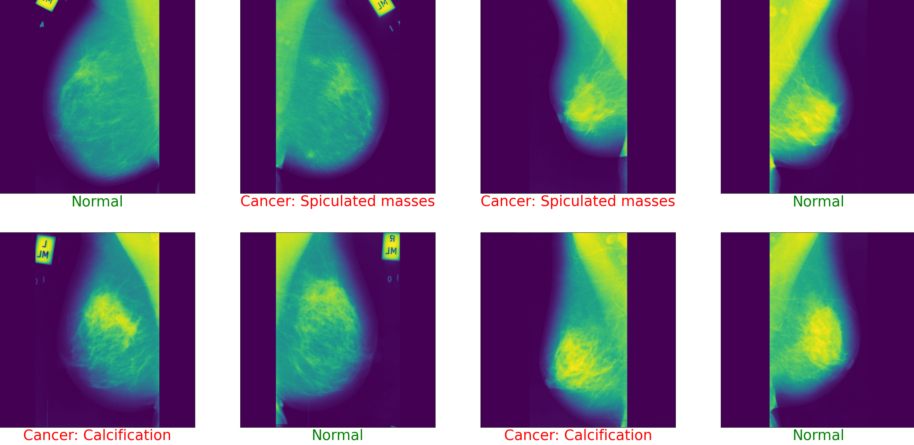

# Breast-Cancer-Recognition-ML
- Sequential Neural Network model that classifies mammograms as normal (no breast cancer) or having a specific type of breast cancer.

- The model was implemented using TensorFlow and Keras on top of Python.

## Implementation Notes:
1. Processing:
    - [x] Reading PGM files
    - [x] Reading CSV files
    - [x] Image pre-processing
2. Model Architecture:
- [x] Sequential Layers:
    - [x] 4 Convolutions
    - [x] 3 Max Pooling
    - [x] Dropout
    - [x] 3 Dense layers
- [x] Layer specifications:
    - [x] ReLU / Softmax Activations
    - [x] Crossentropy loss
    - [x] RMSProp Optimizer
3. Making predictions:
    - [x] Displaying mammograms
    - [x] Labeling them